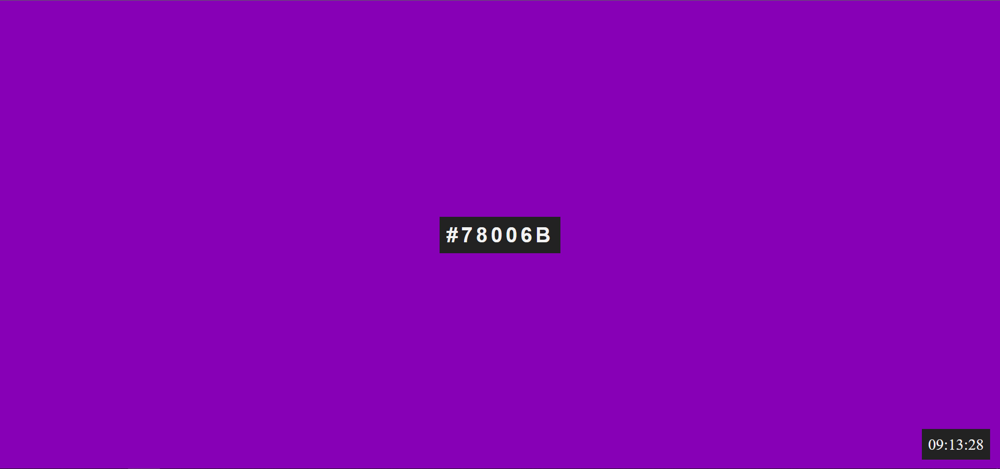

Color Of The Time ⏱

## Table of contents

- [Summary](#summary)
- [Screenshot](#screenshot)
- [Link](#links)
- [Built with](#built-with)

##

In this project, I have worked with DOM manipulation and timers in JavaScript. Reviewing setTimeout and setInterval timers was really cool with this project. I've enjoyed to convert rgb() color format to hex code 🎨 and it was great to try some new DOM methods like copy the selected string to the clipboard 📋. I like building projects with vanilla-js and it keeps me up!💥

- Features of the colorOFTheTime:
  > Colors are generated in 1 second and users can copy the hex code by clicking text box.
  > Also, we can see the time on the page thanks to the Date object in JavaScript.

## Links

<a href="https://birkan-dogan.github.io/colorOfTheTime/">Live Version of the project</a>

## Screenshot

## Built with

- HTML
- CSS
- JavaScript

 Keep Building 🚀

